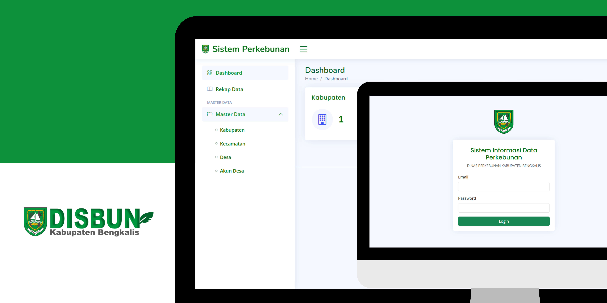

<div align="center">


##

### Sistem Informasi Data Perkebunan Rakyat, Dinas Perkebunan Kabupaten Bengkalis

</div>

## 📙 Description

Sistem Informasi Data Perkebunan Rakyat is an application designed to collect plantation survey data in each village in Bengkalis Regency. This application provides a solution for the Bengkalis Regency Plantation Service in collecting data during plantation surveys.



## 📖 Features

Interesting features of Sistem Informasi Data Perkebunan Rakyat:

1. **Authentication**: Admins can log in to the application via a registered account.

2. **CRUD Data**: Can add, view, change, search and delete data on procurement of equipment and goods and tools as well as record the IP list for each polyclinic available at Bengkalis Regional Hospital.

3. **Plantation Survey**: Plantation Survey is a data collection method used to obtain information related to various aspects of the plantation sector.

## 🛠️ Project Installation Guide

Following are the steps to install a Laravel project:

### Prerequisites

Make sure you have [Node.js](https://nodejs.org/) and [Composer](https://getcomposer.org/) installed on your system before starting the installation.

### Steps

**1.** Clone your Laravel project repository into a local directory:

```bash
git clone https://github.com/ramadhanabelio/sidp-disbun.git
```

**2.** Go to the project directory:

```bash
cd sidp-disbun
```

**3.** Install JavaScript dependencies using npm:

```bash
npm install
```

**4.** Install PHP dependencies using composer:

```bash
composer install
```

**5.** Rename the .env.example file to .env. This is the Laravel configuration file:

**Linux, macOS:**

```bash
mv .env.example .env
```

**Windows:**

```bash
ren .env.example .env
```

**6.** Create a database with a name according to your project, for example "sidp_disbun", and configure the .env file to set the database name:

Open the .env file using a text editor and find the following line:

```bash
DB_DATABASE=laravel
```

Replace database_name with the name you used for the database. For example:

```bash
DB_DATABASE=sidp_disbun
```

**7.** Generate application key:

```bash
php artisan key:generate
```

**8.** Create and migrate database (in this case, we use migrate:fresh to delete and repopulate database data):

```bash
php artisan migrate:fresh --seed
```

**9.** Run the Laravel development server:

```bash
php artisan serve
```

After following the steps above, your Laravel project is now ready to use and can be accessed via the browser at http://localhost:8000.
